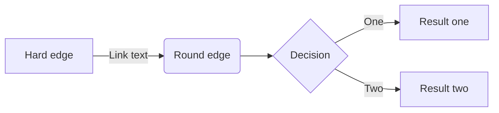
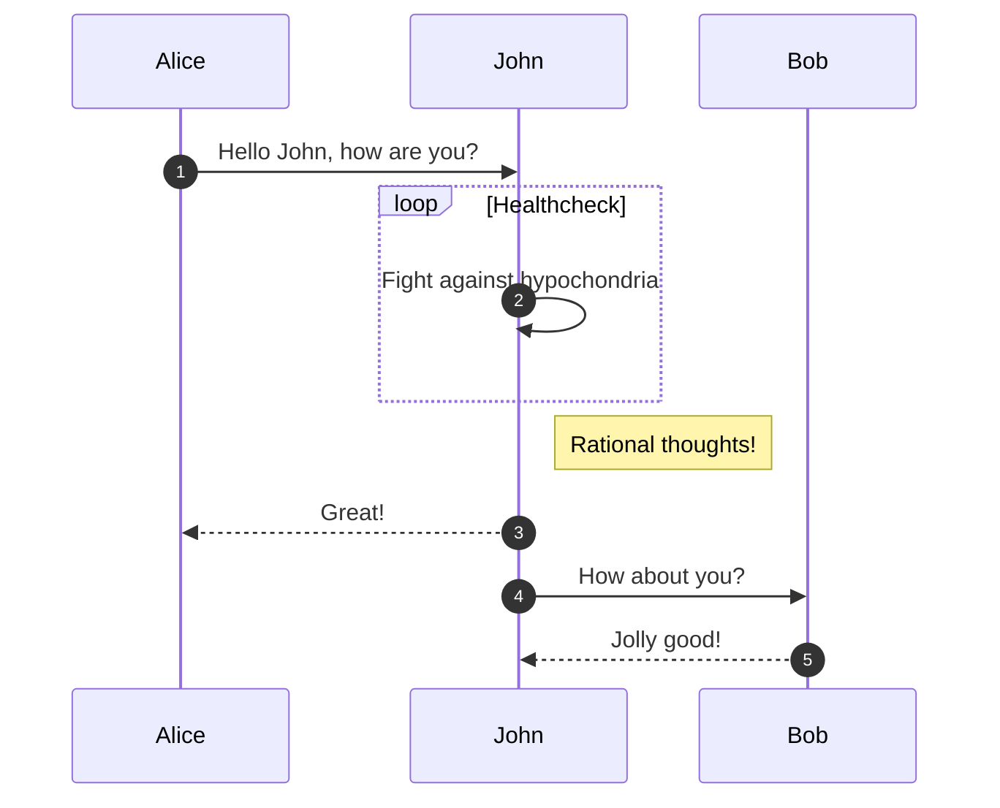
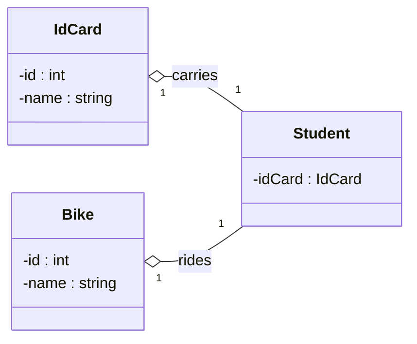
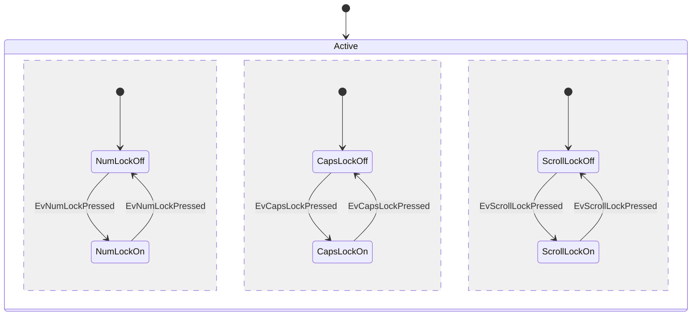
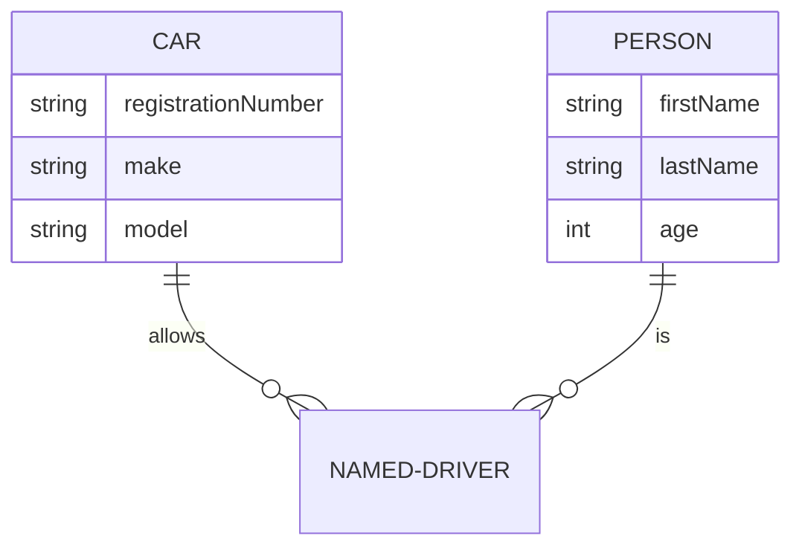
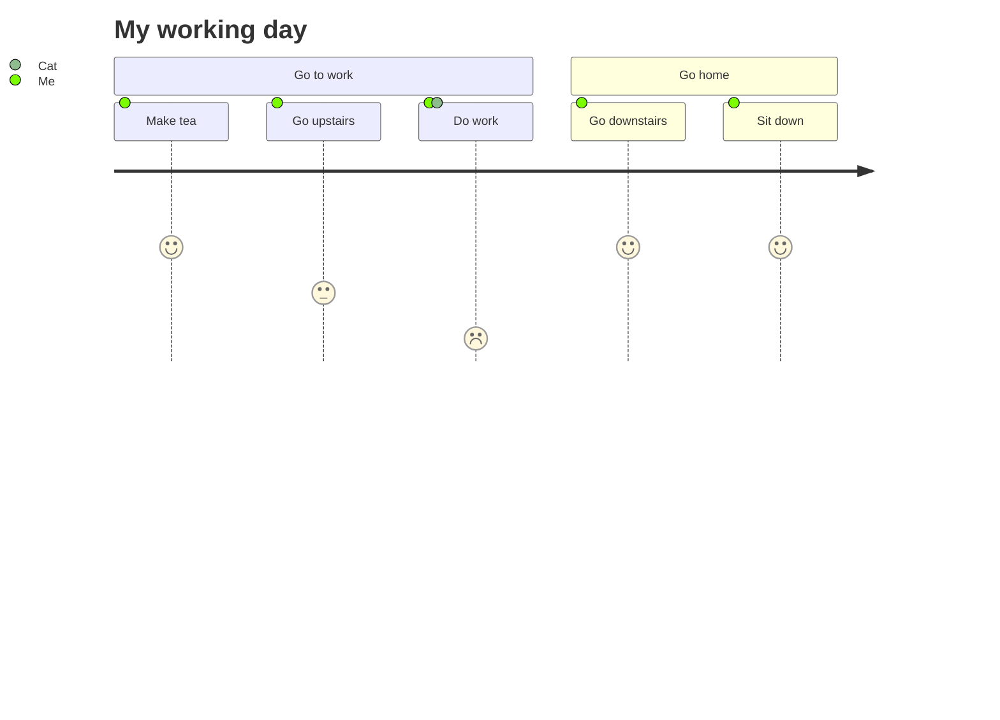
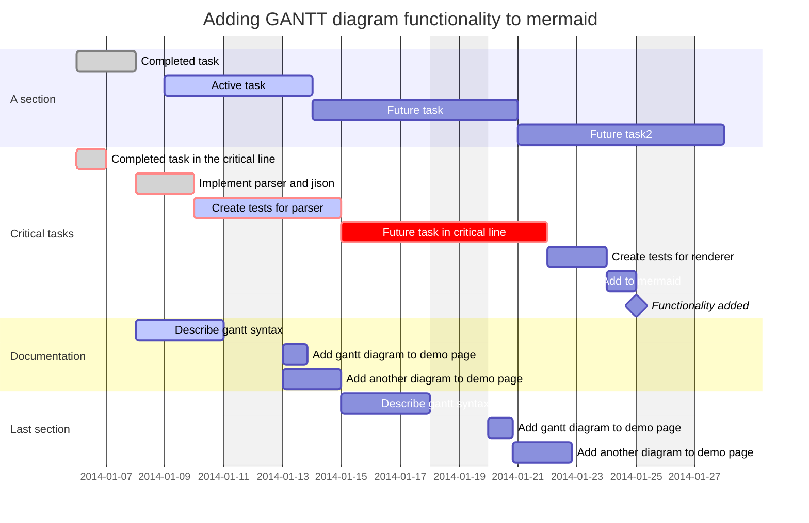
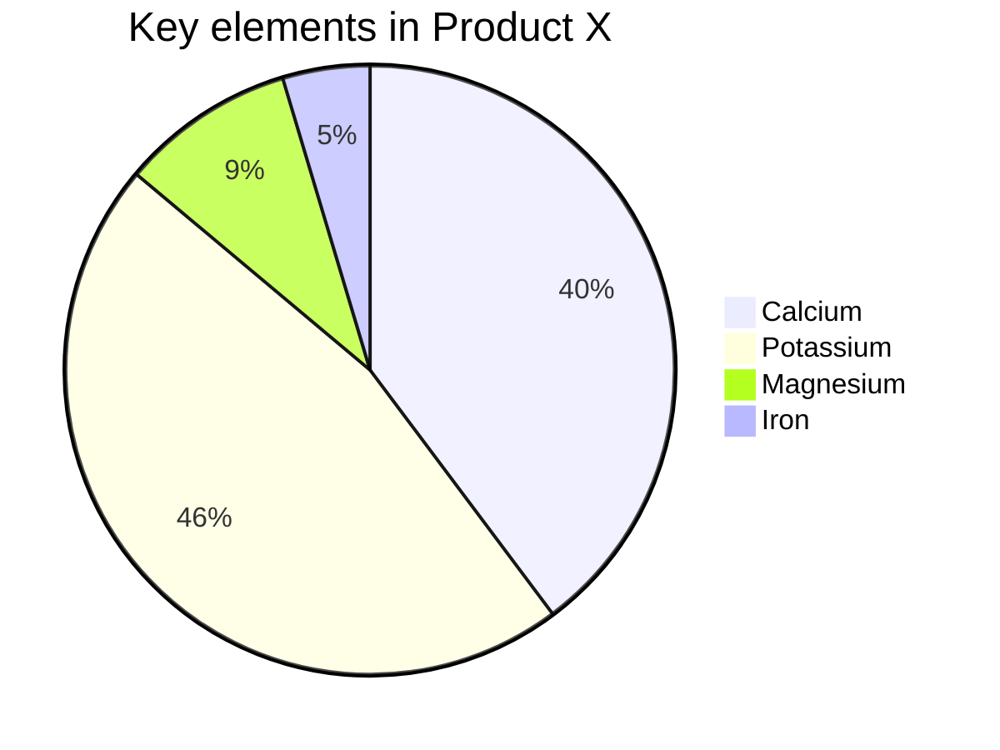

# Jekyll Mermaid js 사용하기


Markdown 작성시 다이어그램 툴로 많이 사용하는 Mermaid js Jekyll 적용하기

---

## Mermaid

### Mermaid?


[mermaid-js](https://mermaid-js.github.io/mermaid/#/)

Markdown에서 Mermaid syntax를 이용하여 여러 다이어그램과 차트들을 텍스트 기반으로 작성하여 렌더링할 수 있다.

예를 들면 아래와 같은 다이어그램들을 외부 draw tool 없이 쉽게 작성이 가능하다.

관련 내용을 작성할때 매우 유용하므로 익혀두면 좋다.

<br>

#### Flowchart

##### Mermaid rendered

<div class="mermaid">
  flowchart LR
    A[Hard edge] -->|Link text| B(Round edge)
    B --> C{Decision}
    C -->|One| D[Result one]
    C -->|Two| E[Result two]
</div>

##### In Mermaid syntax




<br>

#### Sequence Diagram

##### Mermaid rendered

<div class="mermaid">
  sequenceDiagram
    autonumber
    Alice->>John: Hello John, how are you?
    loop Healthcheck
        John->>John: Fight against hypochondria
    end
    Note right of John: Rational thoughts!
    John-->>Alice: Great!
    John->>Bob: How about you?
    Bob-->>John: Jolly good!
</div>

##### In Mermaid syntax




<br>

#### Class Diagram

##### Mermaid rendered

<div class="mermaid">
classDiagram
  direction RL
  class Student {
    -idCard : IdCard
  }
  class IdCard{
    -id : int
    -name : string
  }
  class Bike{
    -id : int
    -name : string
  }
  Student "1" --o "1" IdCard : carries
  Student "1" --o "1" Bike : rides
</div>

##### In Mermaid syntax




<br>

#### State Diagram

##### Mermaid rendered

<div class="mermaid">
stateDiagram-v2
    [*] --> Active
  state Active {
    [*] --> NumLockOff
    NumLockOff --> NumLockOn : EvNumLockPressed
    NumLockOn --> NumLockOff : EvNumLockPressed
    --
    [*] --> CapsLockOff
    CapsLockOff --> CapsLockOn : EvCapsLockPressed
    CapsLockOn --> CapsLockOff : EvCapsLockPressed
    --
    [*] --> ScrollLockOff
    ScrollLockOff --> ScrollLockOn : EvScrollLockPressed
    ScrollLockOn --> ScrollLockOff : EvScrollLockPressed
}
</div>

##### In Mermaid syntax




<br>

#### Entity Relationship Diagram

##### Mermaid rendered

<div class="mermaid">
  erDiagram
    CAR ||--o{ NAMED-DRIVER : allows
    CAR {
        string registrationNumber
        string make
        string model
    }
    PERSON ||--o{ NAMED-DRIVER : is
    PERSON {
        string firstName
        string lastName
        int age
    }
</div>

##### In Mermaid syntax



<br>

#### User Journey

##### Mermaid rendered

<div class="mermaid">
  journey
    title My working day
    section Go to work
      Make tea: 5: Me
      Go upstairs: 3: Me
      Do work: 1: Me, Cat
    section Go home
      Go downstairs: 5: Me
      Sit down: 5: Me
</div>

##### In Mermaid syntax



<br>

#### Gantt

##### Mermaid rendered

<div class="mermaid">
  gantt
    dateFormat  YYYY-MM-DD
    title       Adding GANTT diagram functionality to mermaid
    excludes    weekends
    %% (`excludes` accepts specific dates in YYYY-MM-DD format, days of the week ("sunday") or "weekends", but not the word "weekdays".)
  section A section
Completed task            :done,    des1, 2014-01-06,2014-01-08
Active task               :active,  des2, 2014-01-09, 3d
Future task               :         des3, after des2, 5d
Future task2              :         des4, after des3, 5d
  section Critical tasks
Completed task in the critical line :crit, done, 2014-01-06,24h
Implement parser and jison          :crit, done, after des1, 2d
Create tests for parser             :crit, active, 3d
Future task in critical line        :crit, 5d
Create tests for renderer           :2d
Add to mermaid                      :1d
Functionality added                 :milestone, 2014-01-25, 0d
section Documentation
Describe gantt syntax               :active, a1, after des1, 3d
Add gantt diagram to demo page      :after a1  , 20h
Add another diagram to demo page    :doc1, after a1  , 48h
section Last section
Describe gantt syntax               :after doc1, 3d
Add gantt diagram to demo page      :20h
Add another diagram to demo page    :48h
</div>

##### In Mermaid syntax



<br>

#### Pie Chart

##### Mermaid rendered

<div class="mermaid">
  pie
    title Key elements in Product X
    "Calcium" : 42.96
    "Potassium" : 50.05
    "Magnesium" : 10.01
    "Iron" :  5
</div>

##### In Mermaid syntax



---

## Jekyll with mermaid

Jekyll에서는 기본적인 Jekyll Template에서 Mermaid를 제공하지는 않는 것으로 보인다.

Mermaid를 사용하려면 [jekyll-spaceship](https://github.com/jeffreytse/jekyll-spaceship)과 같은 별도의 플러그인을 설치해야하는 것으로 보임.

현재 사용중인 [Type on Strap](http://jekyllthemes.org/themes/Type-on-Strap/) 테마에서는 mermaid-js를 포함하고 있어 아래와 같이 HTML 문법으로 매핑하여 작성이 가능하다.

> 현재 사용중인 테마에서 지원 여부를 확인 후 plugin 도입을 검토해보면 좋을 것 같다.

#### Mermaid rendered

<div class="mermaid">
sequenceDiagram
    Alice->>John: Hello John, how are you?
    John-->>Alice: Great!
</div>

#### In Mermaid syntax wrapped in HTML

```html
<div class="mermaid">
sequenceDiagram
    Alice->>John: Hello John, how are you?
    John-->>Alice: Great!
</div>
```

---

## Reference

3. [Mermaid-js](https://mermaid-js.github.io/mermaid/#/)
4. [Type-on-Strap](https://github.com/Sylhare/Type-on-Strap)
3. [jekyll-spaceship](https://github.com/jeffreytse/jekyll-spaceship)

