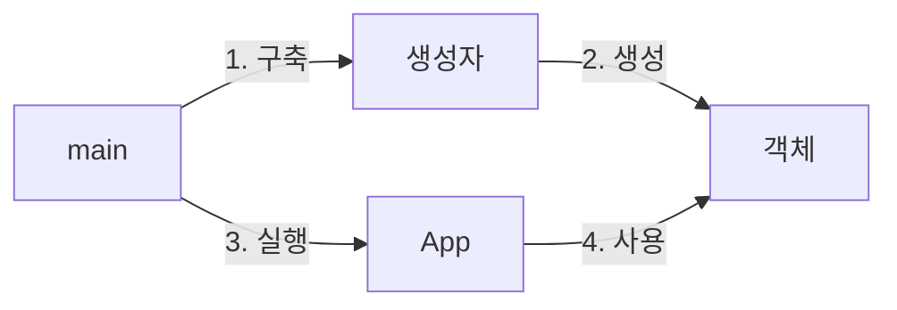
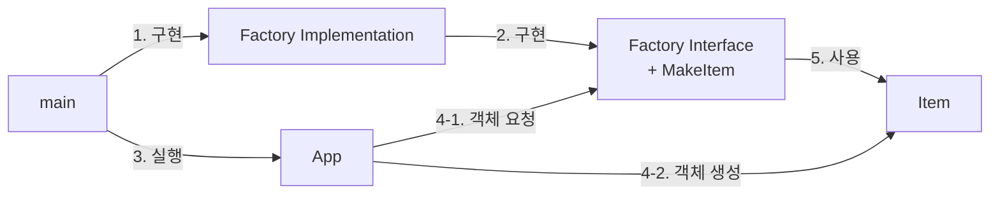

# Clean Code 정리


[Clean Code(클린 코드)](http://www.kyobobook.co.kr/product/detailViewKor.laf?mallGb=KOR&ejkGb=KOR&barcode=9788966260959)

로버트 C.마틴 저 **클린 코드: 애자일 소프트웨어 장인 정신**을 읽고 정리해보았다.

---

## 1. 깨끗한 코드

코드(Code): 코드는 고객의 요구사항을 상세히 표현하는 언어

### 깨끗한 코드란?

- 우아하고 **보기에 즐거운** 코드 - [바야네 스트롭스트룹](https://ko.wikipedia.org/wiki/%EB%B9%84%EC%95%BC%EB%84%A4_%EC%8A%A4%ED%8A%B8%EB%A1%AD%EC%8A%A4%ED%8A%B8%EB%A3%B9)
- 단순하고 직접적이며 명쾌한 **잘 읽히는** 코드 - [그래디 부치](https://ko.wikipedia.org/wiki/%EA%B7%B8%EB%9E%98%EB%94%94_%EB%B6%80%EC%B9%98)
- **가독성이 좋으며** 다른 사람이 고치기 쉬운 코드 - ["빅" 데이브 토마스](https://en.wikipedia.org/wiki/David_A._Thomas_(software_developer))
- 세세하며 꼼꼼하며 **단정되게 정리**한 코드 - 마이클 페더스
- **중복이 없는** 간단하게 추상화된 코드 - [론 제프리스](https://en.wikipedia.org/wiki/Ron_Jeffries)

깨끗한 코드라는 것은 그 정의가 모호한 만큼 논쟁의 여지가 있으나 전문가들이 입을 모아 말하는 공통점은 **가독성**이다.

우리는 코딩을 할 때 실제로 코드를 작성하는 시간보다 코드를 읽고 이해하는 시간이 훨씬 많다는 것을 경험으로 알고 있다.

**가독성**이 높은 코드는 다른 사람이 고치기 쉬우며 이는 유지보수성이 좋다는 것을 의미한다.

결국 가독성이 높은 코드를 작성하려면 중복 줄이기, 간단한 추상화 고려하기, 철저한 오류 처리, 단위 테스트 등이 동반되어야 하므로 궁극적인 목표라고 볼 수 있겠다.

이 책에서 말하는 깨끗한 코드를 작성하는 방법 또한 항상 올바르다는 단정을 할 수는 없다.

하지만 이 책에서 말하는 여러 기법들은 오랫동안 심사숙고하며 축적된 교훈과 기법이므로 충분히 깨끗한 코드를 작성할 수 있을 것이다.


> 코드 품질을 측정하는 유일한 척도 = WTFs/m
>
> [https://www.osnews.com/story/19266/wtfsm/](https://www.osnews.com/story/19266/wtfsm/)

<br>

---

## 2. 의미 있는 이름

소프트웨어에서의 이름은 어디에서나 쓰인다.

>  함수, 변수, 인수, 클래스, 패키지, 디렉토리, 빌드 파일

이름을 잘 짓는 것 만으로도 가독성이 높은 코드를 작성하는데 큰 도움이 된다.


> 코딩에서 가장 힘든 것이 이름짓기라카더라

<br>

### 의도를 알 수 있도록하라

```java
int d;	// 의도가 분명하지 않음
int daysSinceCreation;	// 의도가 분명한 변수명
```

위 변수 이름을 보면 d라는 이름만을 보고 해당 변수가 어떤 데이터를 담고 있는지 알 수 없다.

```java
public static void copyChars(char a1[], char a2[]) {
  for (int i=0; i<a1.length; i++) {
    a2[i] = a1[i];
  }
}
```

a1[], a2[] 대신 source, destination을 사용한다면 바로 이해할 수 있다.

변수명이 모호하면 코드 맥락을 이해하기 힘들다.

<br>

### 잘못된 정보를 피하라

#### 1. 널리 쓰이는 단어

```java
int hp, aix, sco;
```

위의 단어들은 유닉스 플랫폼을 가리키는 이름이므로 혼란을 야기할 수 있다.

#### 2. 잘못된 타입 변수명

```java
Map<String, String> userList;
```

Map 자료형에 List라는 이름이 포함된 이름을 사용한다면 List 자료형으로 착각할 수 있다.

#### 3. 비슷한 이름

```java
public class XYZControllerStringHandler;
public class XYZControllerHandlerString;
```

서로 다른 역할을 하는 두 클래스가 위와 같은 이름을 가지고 있다면 어떤 것이 핸들러인지 알 수 있을까?

#### 4. l과 O와 같은 혼동될 수 있는 변수명

```java
int a = 1;
if ( O == 1 )
  a = O1;
else
  l = O1;
```

일반적으로 Consolas와 같은 개발 폰트를 사용하면 o, O, 0, l, 1, I와 같은 헷갈리는 단어들을 구분해주기는 하지만 가독성을 저해한다.

<br>

### 의미 없는 추가적인 이름

```java
public class Product {}

public class ProductInfo {}
public class ProductData {}
public class ProductClass {}
public class ProductObject {}
public class TheProduct {}
public class AProduct {}
```

위 클래스는 의미없는 불용어(Noise Word)를 추가한 명명법에 불과하다. 모두 Product라는 이름으로 대체할 수 있다.

<br>

### 중복된 이름

```java
int money;
int moneyAmount;

String name;
String nameString;

String tel;
String telVariable;
```

변수명과 중복된 값이 들어가거나 의미없는 불용어가 추가되어 있다.

<br>

### 발음이 쉬운 이름

```java
class DtaRcrd102 {
  private Date genymdhms;
  private Date modymdhms;
}

class Customer {
  private Date generationTimestamp;
  private Date modificationTimestamp;
}
```

"젠 와이 엠 디 에이치 엠 에스"와 같은 우스꽝스러운 발음은 이해하기 힘들뿐더러 추가적인 설명을 요구한다.

아래와 같이 명명하면 누구나 쉽게 생성일자라는 것을 알 수 있다.

<br>

### 검색하기 쉬운 이름

```java
const int TASK_DAYS = 230;
const int WORK_DAYS_PER_WEEK = 5;

int taskWeeks = ( TASK_DAYS / WORK_DAYS_PER_WEEK);

int taskWeeks = (230 / 5);
```

만약 `WORK_DAYS_PER_WEEK` 대신 5로 검색한다면 5가 포함된 수많은 수식과 코드들이 나올 것이다.

<br>

### 헝가리식 표기법(Hungarian Notation)

> vUsing adjHungarian nnotation vmakes nreading ncode adjdifficult.
>
> [https://stackoverflow.com/a/112080](https://stackoverflow.com/a/112080)
>
> 명헝가리식 명표기법 조을 동사용 조하는 명것 조은 명코드 명읽기 조를 부더 부어렵게 동만든다.

```java
// 변수명 앞에 타입에 해당하는 문자를 붙여주었다.
boolean bCheck;
char chInitial;
int iSize;
// 멤버변수 사용시엔 m_ 접두어를 적어주기도 하였다.
int m_length;
String m_desc;
```

헝가리식 표기법은 예전 C 컴파일러가 타입을 점검하지 않거나 IDE의 기능이 부실했을 때 자료형을 쉽게 알 수 있도록 변수명에 타입을 적어주는 방법이었다.

요즘에는 컴파일러가 타입 체크를 할 뿐더러 IDE가 코드 작성 단계에서 타입체크를 하므로 사용하지 말 것.

<br>

### 인터페이스 클래스와 구현 클래스

```java
// Old
public Interface IShapeFactory {}
public Class ShapeFactory {}

// Now
public Interface ShapeFactory {}
public Class ShapeFactoryImpl {}
```

옛 코드에서 많이 사용하던 방식인데 인터페이스 이름에 접두어 I는 붙이지 않는 편이 좋다.

호출시에 인터페이스를 호출하게 되는데 굳이 인터페이스임을 알릴 필요도 없으며 (추상화) I라는 접두어로 추가적인 정보는 필요 없다.

위와 같이 명명하면 사용자는 인터페이스를 신경 쓸 필요 없이 ShapeFactory라고만 인식하여 호출하면 된다. 

<br>

### 문자 하나

```java
int a;
int b;
int c;
```

문자 하나만 사용하는 경우 최악이다.(반복문의 i, j, k는 전통적으로 이터레이션에 사용하였으므로 괜찮다.)

<br>

### 클래스명

```java
// 명사
public Class Customer {}

// 동사 금지
public Class Proceed {}

// 넓은 범위의 명사 금지
public Class Data {}
public Class Info {}
```

클래스명은 명사, 명사구로 이름을 짓는다.

<br>

### 메서드명

```java
// 동사
public int save() {}

// 명사 금지
public int success() {}
public void user() {}

// 자바의 경우 접근자, 변경자, 조건자는 자바빈 명세에따라 get, set, is 사용
public void setName() {}
public String getName() {}
```

메서드명은 동사, 동사구로 이름을 짓는다.

자바의 경우 접근자, 변경자, 조건자는 자바빈 명세에따라 get, set, is 접두어 사용

<br>

### 기발한 이름 피하기

```java
// 기발한 이름
public int detonate() {}

// 기발하지 않은 일반적인 이름
public int delete() {}
```

기발한 이름은 본인이 생각하기엔 멋있을지 몰라도 보는 사람은 짜증난다.

<br>

### 한 개념에 한 단어 사용

```java
// 모두 동일
public int fetchName() {}
public int retrieveName() {}
public int getName() {}

public Class DeviceController {}
public Class DeviceManager {}
public Class DeviceDriver {}
```

위와 같이 같은 개념에 대하여 여러 단어를 혼동해서 사용한다면 가독성을 저해한다.

<br>

### 한 단어를 두가지 목적으로 사용 금지

```java
public int addNumber(int num1, int num2){}
public int addUser(List<User> users, User user){}

public int addNumber(int num1, int num2){}
public int insertUser(List<User> users, User user){}
```

위의 한 개념에 한 단어 사용과는 반대의 경우이다.

addNumber는 수를 더하는 것이고 addUser는 리스트에 User를 추가하는 것이다.

따라서 add가 아닌 insert, append와 같은 단어가 적절하다.

같은 행위가 아닌데도 같은 단어를 사용하는 것 또한 맥락을 해친다.

<br>

### 불필요한 맥락을 없애라

```java
public Class AAUser {}
public Class AAManagement {}
public Class AAAuthentication {}
```

AA(Admin App)이라는 애플리케이션을 작성한다고 가정했을때 위와 같이 AA를 모두 붙이게 된다면 A를 입력하고 자동완성할 때 모든 클래스가 열거된다.


---

## 3. 함수

### 작게 만들어라

- 규칙 1: **작게!**

- 규칙 2: **더 작게!**

함수는 100줄을 넘어서는 안된다. 아니 20줄도 길다.

중첩 구조가 생길만큼 함수가 길면 안된다. 다시 말해, if/else, while문 등에 들어가는 블록은 한줄이어야 한다.

<br>

### 한가지만 해라!

- 규칙 1: 함수는 **한 가지**를 해야 한다.
- 규칙 2: 그 **한 가지**를 잘해야 한다.
- 규칙 3: 그  **한 가지**만을 해야 한다.

<br>

### 내려가기 규칙

코드는 위에서 아래로 이야기처럼 내려가면서 읽혀야 좋다.

각 함수에서는 한 가지만의 레벨을 구현하며 다음 함수를 호출한다.

<br>

### switch문 피해라

```java
public class UserFactoryImpl implements UserFactory {
	public User makeUser(UserRecord r) throws InvaliedUserType {
    switch (r.type) {
      case ADMIN:
        return new AdminUser(r);
      case MAINTAINER:
        return new MaintainerUser(r);
      case DEVELOPER:
        return new DeveloperUser(r);
      default:
        throw new InvalidUserType(r.type);
    }
  }
}
```

switch문은 피하되 불가피한 경우 다형성 객체로 한번만 사용하라

위 코드에서는 추상 팩토리에 switch문을 숨겨서 사용한다.

<br>

### 서술적인 이름 사용

```java
public static String testableHtml() {}

private void includeSetupAndTeardownPages() {}
```

짧고 어려운 이름보다 길고 서술적인 이름이 좋다.

해당 함수를 보고 어떤 역할을 할 수 있는지 알 수 있어야 한다.

<br>

### 함수 인수는 최대한 적게

```java
public void render(pageData);
public void render();
```

함수 인수는 0개가 가장 이상적이며 필요시 1개, 2개를 사용한다.

3개 이상은 가능한 피하며 4개는 특별한 사유가 있어야만 사용한다.

render(pageData)보다 render()가 훨씬 간결하고 이해하기 쉽다.

#### 인수가 1개인 경우

- 질문 함수

```java
boolean isExists(Object obj) {}
```

- 변환 함수

```java
String getUpperCase(String str) {}
```

- 이벤트 함수

```java
void passwordAttemptFailedNtimes(int attemps) {}
```

#### 인수가 2개인 경우

- 좌표계 함수

```java
Point p = new Point(0, 0);
```

#### 인수가 3개인 경우

```java
assertEquals(message, expected, actual);
```

인수가 여러개인 경우 인수의 순서를 헷갈릴 가능성이 많다.

#### 플래그 인수

```java
render(true)
```

플래그 인수를 사용한다는 것은 해당 함수가 한 가지 이상의 일을 한다는 것을 의미한다.

참이면 A 로직, 거짓이면 B로직 = 2개의 로직

따라서 절대 사용하지 말 것.

#### 인수 객체

```java
Circle makeCircle(double x, double y, double radius);
Circle makeCircle(Point center, double radius);
```

인수가 여러개가 존재한다면 인수를 객체로 넘겨라

#### 가변 인수

```java
public String format(String format, Object... args) {}
```

인수가 가변적일때 사용하는 것을 권장

#### 출력 인수

```java
public void appendFooter(StringBuffer report) {}

// 출력 인수
appendFooter(report);

// this 사용
report.appendFooter();
```

위와 같은 출력인수 대신 객체지향에서는 this라는 키워드를 사용한다.

함수에서 상태를 변경해야할때 인수의 상태를 변경하지 말고 함수가 속한 객체의 상태를 변경해야한다.

<br>

### 함수명

```java
// 동사 + 명사 쌍
setName(name)

// 동사 + 명사 + 인수(순서)
assertExpectedEqualsActual(expected, actual)
```

함수명을 작성할때 동사 + 명사 쌍으로 작성하되 인수가 여러개인 경우 함수명에 키워드로 순서를 명시

<br>

### 명령과 조회를 분리

```java
public boolean set(String key, String value) {}

// 설정하는 함수인가 조회하는 함수인가 혼란스러움
if(set("username","johndoe"))
```

위에서 얘기한 함수는 한가지만을 해야한다는 정의에도 부합한다.

위 함수는 key인 키값을 찾아 value로 설정하고 성공하면 true, 실패하면 false를 리턴한다고 하자

명령과 조회가 한꺼번에 되고 있어 호출시 코드가 지저분해진다.

```java
if(keyExists("username")) {
  set("username","johndoe");
  ...
}
```

위와 같이 명령과 조회를 분리한다면 훨씬 보기좋은 코드가 작성된다.

<br>

### 오류 코드보다 예외 사용

```java
// 오류 코드 사용
if(deleteUser(user) == CODE_OK) {
	logger.log("user deleted");
} else {
	logger.log("delete failed");
}

// 예외 처리 사용
try{
	deleteUser(user);
} catch (Exception e){
  logger.log(e.getMessage());
}
```

예외 처리를 사용하면 오류 코드 처리가 원래 코드에서 분리된다.

---

## 4. 주석

### 주석은 거짓말을 한다

코드는 변화하고 진화하지만 그에 맞게 주석을 유지하고 보수하기란 현실적으로 불가능하다.

주석이 코드에서 분리되어 거짓말을 하는 경우를 흔히 볼 수 있다.

항상 주석은 코드를 따라가지 않는다.

<br>

### 주석은 필요하지 않다

부정확한 주석은 없는 주석보다 잘못된 정보를 제공하므로 훨씬 나쁘다.

그래서 애초에 주석이 필요없는 방향으로 가는 것이 필요하다.

<br>

### 코드로 의도를 표현하라

```java
// 코드의 의도를 모른다
if((user.flags & HOURLY_FLAG) && (employee.age > 55))

// 코드에 의도가 담겨있다
if(employee.isEligibleForFullBenefits())
```

주석을 달기보다 코드 자체에 의도를 담아라

<br>

### 좋은 주석 예시

좋은 주석이란 주석을 달지 않는 것이다.

그럼에도 아래와 같은 예시는 좋은 예시라고 볼 수 있다.


#### TODO 주석

```java
//TODO 현재 필요하지 않다.
protected VersionInfo makerVersion() throws Exception {
  return null;
}
```

앞으로 할 일을 나타내는 TODO 주석은 필요하지만 현재 구현이 어려운 업무를 기술한다.

대부분의 IDE에서 TODO 주석을 찾아 보여주는 기능을 제공한다.

그렇다고 TODO를 남발하면 안되며 주기적으로 TODO 주석을 점검해 없애야한다.


#### 공개 API의 Javadocs


표준 Java 라이브러리의 Javadocs가 훌륭한 예시이다.

잘 작성된 Javadocs는 유용하고 생산성을 높여준다.

하지만 Javadocs 마찬가지로 주석과 같이 코드를 따라가지 못해 거짓말을 할 가능성이 존재한다.

<br>

### 나쁜 주석 예시

#### 주절거리는 주석

```java
public void loadProperteis()
{
	try {
    String path = location+"/"+FILE;
    FileInputStream stream = new FileInputStream(path);
    loadedProperties.load(stream);
  }
  catch(IOException e){
    // 속성 파일이 없으면 기본값을 모두 메모리로 읽어들였다는 의미
  }
}
```

해당 주석만 보고 기본값이 무엇을 의미하는지 알 수 없다.

주석을 보고 다른 코드를 뒤져봐야한다면 절대로 좋은 주석이 아니다.


#### 코드와 중복된 주석

```java
// this.closed가 true일때 반환되는 유틸
// 타임아웃에 도달하면 예외 던짐
public void waitForClose(long timeoutMillis) throws Exception {
  if(!closed){
    wait(timeoutMillis);
    if(!closed){
			throw new Exception("could not be closed");      
    }
  }
}
```

코드만 보고도 이해할 수 있는 내용을 중복해서 적어놓았다.

`ContainerBase.java`

```java
public abstract class ContainerBase extends LifecycleMBeanBase implements Container {
    // ----------------------------------------------------- Instance Variables


    /**
     * The child Containers belonging to this Container, keyed by name.
     */
    protected final HashMap<String, Container> children = new HashMap<>();


    /**
     * The processor delay for this component.
     */
    protected int backgroundProcessorDelay = -1;


    /**
     * The future allowing control of the background processor.
     */
    protected ScheduledFuture<?> backgroundProcessorFuture;
    protected ScheduledFuture<?> monitorFuture;

    /**
     * The container event listeners for this Container. Implemented as a
     * CopyOnWriteArrayList since listeners may invoke methods to add/remove
     * themselves or other listeners and with a ReadWriteLock that would trigger
     * a deadlock.
     */
    protected final List<ContainerListener> listeners = new CopyOnWriteArrayList<>();
  ...

```

위는 톰캣의 ContainerBase.java이다.

Javadocs와 중복되며 기록 외에는 쓸데없는 주석이 많다.


#### 당연하거나 의무적인 주석

```java
/**
*
* @param name 사용자 이름
* @param email 사용자 이메일
* @param age 사용자 나이
*/
public void addUser(String name, String email, int age) {
  User user = new User();
  user.name = name;
  user.email = email;
  user.age = age;
  userList.add(user);
}
```

주석 없이 코드만 보고 쉽게 이해할 수 있다.


#### 이력 기록용 주석

```java
/**
* 변경 이력 (21-10-2019부터)
* -----------------------
* 21-10-2019 : ~ 변경
* 27-10-2019 : ~ 추가
* 21-11-2019 : ~ 버그 수정
* 21-12-2019 : ~ Serializable 구현
*/
```

예전에 git과 같은 소스코드 관리 시스템이 없었을 때나 사용하던것


#### 저자 표시 주석

```java
/* 20210113 최승훈 추가 */
```

버전관리 시스템에 모든 정보가 나와있으므로 불필요한 주석


#### 주석처리된 코드

```java
InputStreamResponse resposne = new InputStreamResponse();
// InputStream resultsStream = formatter.getResultStream();
```

주석처리된 코드는 다른 사람이 지우기를 주저한다.

원저자가 이유가 있어서 남겨두었겠지 혹은 중요하다는 생각에 지우면 안된다고 생각한다.

이런 쓸모없는 코드가 계속 추가되다보면 코드가 더러워진다.

1960년대에는 이런 방식이 유용했으나 현재는 버전 관리 시스템이 코드를 기억하므로 가차없이 지워라


`commons.java`

```java
this.bytePos = writeBytes(pngIdBytes, 0);
//hdrPos = bytePos;
writeHeader();
writeResolution();
//dataPos = bytesPos;
if(writeImageData()) {
	writeEnd();
  this.pngBytes = resizeByteARray(this.pngBytes, this.maxPos);
}
else {
  this.pngBytes = null;
}
return this.pngBytes;
```

아파치 commons에서 발췌한 코드

누가 어떤 의미로 주석으로 처리하여 남겨두었는지 알 수 없다.


#### HTML 주석

```java
/**
* <p>
* $lt;execute-tests
*		suitepage=&quot;SuiteAcceptanceTests&quot; /&gt;
* </p>
*/
```

주석은 사람이 읽으라고 만든 것

주석이 HTML 태그를 삽입하는 건 개발자의 몫이 아니라 개발환경 툴의 몫이다.


#### 너무 많은 정보

```java
/*
RFC 2045 - Multipurpose Internet MAil Extensions (MIME)
6.8.  Base64 Content-Transfer-Encoding
The Base64 Content-Transfer-Encoding is designed to represent
arbitrary sequences of octets in a form that need not be humanly
readable.  The encoding and decoding algorithms are simple, but the
encoded data are consistently only about 33 percent larger than the
unencoded data.
*/
```

필요한 정보만 담아라

---

## 5. 형식 맞추기

### 코드 형식

코드 형식은 의사소통의 일환으로 개발자의 일차적 의무

잘 돌아가는 코드도 중요하지만 해당 구현 기능은 다음 버전에서 바뀔 확률이 있다.

그러나 오늘 구현한 코드의 가독성은 앞으로 품질에 매우 큰 영향을 미친다.

팀 합의하에 간단한 규칙을 정하고 모두가 따라야한다.

<br>

### 적절한 코드 길이

| 프로젝트 | 평균      |
| -------- | --------- |
| junit    | 65줄      |
| testNG   | 70줄      |
| tam      | 70줄      |
| ant      | 200~500줄 |
| Tomcat   | 200~500줄 |

대다수 자바 프로젝트의 평균 파일 크기는 약 65줄로 500줄을 넘지않고 대부분 200줄정도로도 대규모의 시스템을 구현할 수 있다.

<br>

### 세로 밀집

```java
public class ReporterConfig {
  private String name;
  
  // 세로 밀집
  private List<Property> properties = new ArrayList<Property>();
  public void add Property(Property property){
    m_properties.add(property);
  }
}
```

연관된 개념 & 기능은 세로로 가까이에 위치하도록 작성한다.

<br>

### 수직 거리

#### 변수 선언

```java
// 최대한 가까운 시점에 선언
private static void readPreferences() {
  InputStream is = null;
  try {
    is=newFileInputStream(getPreferencesFile());
  } catch (Exception e){
    ...
  }
  ...
}

// 루프내 사용하는 변수는 루프문 내부에 선언
for(int i=0; i<userList.length(); i++){
  User user = userList.get(i);
}

for(User user : userList){
  ...
}
```

변수 선언 시점은 최대한 가까운 사용 시점으로 한다.

#### 인스턴스 변수 선언

```java
public class User implements Person {
  private String name;
  private String email;
  ...
    
  private String doSomething(){
    ...
  }
  ...
    
  private int age;
  
  private String doSomethingCool(){
    ...
  }
}
```

인스턴스 변수의 경우 보통 클래스의 맨 앞쪽에 선언한다.

코드를 읽는 사람이 중간에 인스턴스 변수 선언을 발견한다면 매우 혼란스러울 것이다.

> 다만 C++에서는 가위 규칙(scissorrs rule)을 적용하여 클래스 마지막에 선언한다고 한다.

#### 종속 함수

```java
public void loadPage(){
  String pageName = getPageName();
  ...
}

public String getPageName(){}
```

어떤 함수가 다른 함수를 호출한다면 해당 함수는 세로로 가까이 배치한다.


### 가로 밀집

#### 가로 공백

```java
totalChars += lineSize;	// 연산자 앞 뒤로 공백으로 분리
lines.addLine(lineSize, lineCount);	// 쉼표 뒤 공백으로 인수 분리 명확히
```

#### 가로 정렬

```java
public class User {
  private 	String 						name;
  private 	String 						email;
  private 	int 							age;
  protected UserDetail 				detail;
  private 	SomeLongClassName someLongName;
  private		Long 							requestParsingTimeLimit;
  
  public void User(String name, String email){
  	this.name = 							name;
    this.email = 							email;
    requestParsingTimeLimit = 10000;
	}
}
```

위와 같이 선언하게 되면 선언부를 읽다가 변수 유형을 무시하고 변수 이름을 먼저 보게 된다.

할당문의 경우에는 할당 연산자는 눈에 잘 안들어오고 변수 이름부터 보게된다.

#### 들여쓰기(Indentation)

```java
public class Comment extends Text {
  public static final String REGEXP ="^#[%\r\n]*(?:(?:\r\n)|\n|\r)?";
  public Comment(Parent parent, STring, text) {super(parent, text);}
  public String render() {return "";}
}
```

IDE에서 자동으로 관리해주기 때문에 중요성을 잃어버리기 쉽지만 가독성에 아주 중요하다.

위와 같이 짧은 코드인 경우에는 한 줄에 쓰고싶은 욕망이 들지만 규칙을 지키기 위하여 들여쓰기를 해준다.

---

## 6. 객체와 자료구조

### 자료 추상화

```java
// 구체적 클래스
public class Point {
  public double x;
  public double y;
}

// 추상화 클래스
public interface Point {
  double getX();
  double getY();
  void setCartesian(double x, double y);
  double getR();
  double getTheta();
  void setPolar(double r, double theta);
}
```

위 구체적 클래스에서는 직교 좌표계를 사용하도록 강제한다.

하지만 아래 추상화 클래스를 이용한다면 직교 좌표계 뿐만 아니라 원통 좌표계와 같은 다른 좌표계도 사용이 가능하여 확장성이 좋다.

<br>

### 자료/객체 비대칭

자료 구조와 객체는 비대칭적인 특징을 지닌다.

**자료 구조**: **자료를 보여주며** 별도의 **함수를 제공하지는 않는다**.

**객체**: 추상화 뒤로 **자료를 숨기며** 그를 다루는 **함수를 제공한다**.

##### 예시) 절차적인 도형

```java
public class Square extends Shape {
	public Point point;
	public double length;
}

public class Circle extends Shape {
	public Point center;
	public double radius;
}

public class Rectangle extends Shape {
	public Point point;
	public double height;
  public double width;
}

public class Geometry {
  public final double PI = 3.14159265358979323846;
  public double area(Object shape) throws NoSuchShapeException {
    if(shape instanceof Square) {
      Square s = (Square)shape;
      return s.length * s.length;
    }
    else if(shape instanceof Circle) {
			Circle c = (Circle)shape;
      return PI * c.radius * c.radius;
    }
    else if(shape instanceof Rectangle){
            Rectangle r = (Rectangle)shape;
      return r.height * r.width;
    }
    
    throw new NoSuchShapeException();
  }
}
```

위 코드는 if else로 이루어진 절차지향 프로그램이기 때문에 객체 지향 관점에서 봤을때 아름답지 못한 코드이다.

하지만 새로운 함수가 추가되었을 때 각각의 도형 클래스를 변경할 필요가 없다.


##### 예시) 다형적인 도형

```java
public class Square extends Shape {
	public Point point;
	public double length;
  
  public double area() {
    return length * length;
  }
}

public class Circle extends Shape {
	public Point center;
	public double radius;
  public final double PI = 3.14159265358979323846;
  
  public double area() {
    return PI * radius * radius;
  }
}

public class Rectangle extends Shape {
	public Point point;
	public double height;
  public double width;
  
  public double area() {
    return height * width;
  }
}

public class Geometry {
  public final double PI = 3.14159265358979323846;
  public double area(Object shape) throws NoSuchShapeException {
    return shape.area();
    throw new NoSuchShapeException();
  }
}
```

다형성을 활용한 예시이다.

이 경우에는 절차적인 프로세스가 존재하지 않지만 새로운 함수가 추가되었을때 각각의 도형 클래스들에 함수를 추가해주어야 한다.

때로는 단순한 자료구조와 절차적인 코드가 적합한 경우가 있다.

<br>

### 디미터 법칙

디미터 법칙은 메서드가 자신이 조작하는 객체의 내부 구조를 몰라야한다는 뜻이다.

```java
// 디미터 법칙 준수하지 않음(기차 충돌)
final String outputDir = ctx.getOptions().getScratchDir().getAbsolutePath();

// 디미터 법칙 준수
Options opts = ctx.getOptions();
File scratchDir = opts.getScratchDir();
final STring outputDir = scratchDir.getAbsolutePath();
```

위 예시에서는 getOptions로 불러온 객체의 getScratchDir로 불러온 객체의 getAbsolutePath를 가져온다.

위와 같은 코드를 기차 충돌(Train wreck)이라고 부른다.

연속으로 호출하는 객체가 자료구조라면 상관 없지만 객체라면 디미터 법칙에 위배된다.

<br>

### 자료 전달 객체(Database Transfer Object)

```java
public class Address {
  private String street;
  private String city;
  private String state;
  private String zip;
  
  public Address(String street, String city, String state, String zip) {
    this.street=street;
    ...
  }
  
  public String getStreet(){
    return this.street;
  }
  ...
    
  public void setStreet(){
    this.street=street;
  }
}
```

일반적으로 자료 구조 객체는 공개 변수만 있고 함수는 없다.

위와 같은 자료 구조 객체를 자료 전달 객체(Data Transfer Object, DTO)라고 한다.

데이터베이스와 통신하거나 소켓 메시지등에 유용하게 사용된다.

#### 활성 레코드

```java
public class Address {
  private String street;
  private String city;
  private String state;
  private String zip;
  
  public Address(String street, String city, String state, String zip) {
    this.street=street;
    ...
  }
  
  public String getStreet(){
    return this.street;
  }
  ...
    
  public int save(){
    ...
  }
  
  public String findCity(){
    ...
  }
}
```

위 DTO코드에 save나 find같이 탐색 함수가 추가된 경우는 특수한 경우로 일반적으로 객체가 아닌 자료 구조로 가정한다.

하지만 해당 레코드에 비즈니스 로직을 추가하여 개발하는 경우가 있으나 이는 바람직하지 못하다.


### 결론

자료구조는 함수를 추가하기 편하다.

객체는 객체 타입을 추가하기 편하다.

요구사항이 새로운 동작을 추가하는 작업이 많은 경우 => 자료구조체 사용

요구사항이 새로운 자료형을 추가하는 경우가 많은 경우 => 객체 사용

---

## 7. 오류 처리

### Try-Catch-Finally문부터 작성하라

Try catch finally 블록은 트랜잭션과 비슷한 역할을 한다.

예외가 발생하는 상황이면 항상 try-catch-finally 문부터 시작하라.


### 예외에 의미를 부여하라

예외에 발생하는 호출 스택만으로는 오류 원인과 위치를 찾기 부족할 때가 있다.

따라서 애플리케이션 로깅 기능과 같은 방법을 이용하여 오류 메시지에 충분한 정보를 담아 보내라.


### 예외 클래스를 정의하라

```java
LocalPort port = new LocalPort(8080);

try {
  port.open();
} catch (DeviceResponseException e) {
  reportPortError(e);
  logger.log("Device resposne exception", e);
} catch (UnlockedException e) {
  reportPortError(e);
  logger.log("Unlock exception", e);
} catch (GMXError e) {
  reportPortError(e);
  logger.log("Device resposne exception", e);
} finally {
  ...
}
```

위 코드와 같이 발생하는 모든 에러에 대해서 처리하는 것은 불필요한 중복코드를 발생시킨다.

아래와 같이 래퍼(Wrapper) 형태의 예외 클래스를 정의 후 예외 유형을 하나만 사용하는 것이 좋다.

```java
public class LocalPortWrapper {
	private LocalPort innerPort;
  
	public LocalPortWrapper(int portNumber) {
		innerPort = new LocalPort(portNumber);
  }
  
	public void open(){
	try {
		port.open();
		} catch (DeviceResponseException e) {
			throw new PortDeviceFailure(e);
		} catch (UnlockedException e) {
			throw new PortDeviceFailure(e);
		} catch (GMXError e) {
			throw new PortDeviceFailure(e);
    } finally {
    	...
    }
  }
}

```

```java
try {
  port.open();
} catch (DeviceResponseException e) {
  reportPortError(e);
  logger.log(e.getMessage(), e);
} finally {
  ...
}
```

실제로 외부 API를 사용한다면 래퍼 클래스가 매우 유용하다.


### null을 반환하지 마라

```java
public void register(User user){
  if(user != null) {
    UserRegistry registry = persistentStore.getUserRegistry();
    if(registry != null){
      User exists = registry.getUser(user.getID());
    }
  }
}
```

null값을 반환하는 코드는 개발자에게 null 체크를 강요한다.

누구 하나라도 null 검사를 누락하는 순간 프로그램은 NPE(Null Pointer Exception)이 발생하며 멈출수도 있다.

null 검사를 누락하지 않으면 된다고는 하지만 실제로 개발시 null 체크가 많은 것을 확인할 수 있다.

메서드에서 null을 반환하고 싶다면 대신 예외를 던지거나 특수 사례 객체를 반환한다.

```java
public class Calculator {
  public double xProject(Point p1, Point p2){
    if(p1==null || p2==null) {
      throw InvalidArgumentException("Invalid Argument for Calculator.xProject");
    }
    return (p2.x - p1.x) * 1.5;
  }
}
```

대부분의 프로그래밍 언어는 호출 인자의 null을 적절히 처리하는 방법이 없다.

따라서 애초에 null을 반환하거나 인수로 넘기는 경우를 차단하는 정책이 합리적

---

## 8. 경계

개발할때 시스템에 들어가는 외부 패키지나 라이브러리를 사용한다.

**인터페이스 제공자**: 확장성을 최대한 넓혀 더 많은 환경에 제공하려 하고

**인터페이스 사용자**: 자신의 요구사항에 부합하는 구체적인 인터페이스를 원한다.

따라서 이러한 인터페이스 경계에서 문제가 발생할 소지 있음

<br>

### 외부코드 사용하기

```java
Map<String, Device> devices = new HashMap<>();
Device device = devices.get(deviceId);
```

위와 같이 사용할 때 해당 map 인스턴스를 여기저기서 사용한다면 인터페이스가 변경되었을 경우 수정할 코드가 상당히 많아진다.

```java
public class Devices {
	private Map<String, Device> devices = new HashMap<>();
  
  public Device getDeviceById(String id) {
    return (Device) devices.get(id);
  }
}
```

위와 같이 경계 인터페이스인 Map을 Devices 안으로 숨기면 Map 인터페이스가 변경되더라도 나머지 코드에는 영향을 끼치지 않는다.

Devices 클래스 안에서 객체 유형을 관리하기 때문

또한 경계 인터페이스를 오픈 API의 인수나 반환값으로 설정하지 않는다 => 변경될 수 있다.

<br>

### 아직 존재하지 않는 코드 사용하기

개발 도중 아직 정의되지 않은 외부 코드나 깊숙히 들어가야할 때가 있다.

통제 밖이거나 정의되지 않은 코드를 사용할 때 별도 인터페이스로 분리하여 설계한다.

자체 인터페이스를 정의 후 정의된 코드만 구현하면 코드는 훨씬 깔끔해진다.

추후에 어댑터를 사용하여 실제 구현된 인터페이스와의 통신이 가능하다.

<br>

### 깨끗한 경계

경계에 위치하는 코드(외부 라이브러리, 외부 패키지)는 깔끔히 분리한다.

외부 패키지를 세세히 알 필요 없이 통제가 불가능한 외부 패키지 의존성을 낮추고 통제가 가능한 우리 코드로 의존하도록 코드를 작성한다.

1. 외부 패키지 호출 코드를 가능한 줄이기
2. 새로운 클래스로 경계 인터페이스를 감싸기
3. 어댑터 패턴을 사용하여 우리 인터페이스로 변경하기

---

## 9. 단위 테스트

TDD 이전의 테스트란 프로그램이 돌아가는 사실을 확인하는 일회성 코드였다.

### TDD 법칙

지금은 테스트 케이스를 모두 구현하고 통과해야하며 애자일과 TDD를 이용하여 단위테스트를 자동화한다.

1. 실패하는 단위 테스트 작성할 때까지 실제 코드 작성 금지
2. 컴파일을 실패하지 않으면서 실행이 실패하는 정도로만 단위테스트 작성
3. 현재 실패하는 테스트를 통과할 정도로만 실제코드 작성

<br>

### 테스트코드

테스트코드는 실제 코드 못지 않게 중요하다.

단위 테스트는 코드를 유연하게 하고 유지보수 쉽게 하고 재사용을 쉽게 만든다.

#### 테스트코드가 없는 경우

- 모든 변경이 잠정적인 버그다.
- 한 쪽을 수정하면 다른 쪽에서 안전하다는 보장을 하지 못한다.
- 의도하지 않은 결함이 발생한다.

<br>

### 깨끗한 테스트 코드 만들기

깨끗한 테스트 코드를 만들려면 세 가지가 필요하다.

1. **가독성**
2. **가독성**
3. **가독성**

테스트코드는 최소의 표현으로 많은 것을 나타내야 한다.

BUILD-OPERATE-CHECK 패턴을 사용하는 것이 좋음

테스트 자료를 만들고, 조작하고, 확인한다.

잡다한 코드를 지우고 위 3가지에 해당하는 코드만 작성한다.

<br>

### 도메인 특화 테스트 언어

```java
public class UserAssert extends AbstractAssert<UserAssert, User> {
 
    private UserAssert(User actual) {
        super(actual, UserAssert.class);
    }
 
    public static UserAssert assertThatUser(User actual) {
        return new UserAssert(actual);
    }
 
    public UserAssert hasEmail(String email) {
        isNotNull();
 
        Assertions.assertThat(actual.getEmail())
                .overridingErrorMessage( "Expected email to be <%s> but was <%s>",
                        email,
                        actual.getEmail()
                )
                .isEqualTo(email);
 
        return this;
    }
  ...
}
```

```java
@Test
public void registerNewUserAccount() throws Exception {
  ...
    assertThatUser(createdUserAccount)
      .hasEmail(REGISTRATION_EMAIL_ADDRESS)
      .hasFirstName(REGISTRATION_FIRST_NAME)
      .hasLastName(REGISTRATION_LAST_NAME)
      .isRegisteredUser()
      .isRegisteredByUsingSignInProvider(SOCIAL_SIGN_IN_PROVIDER);
}
```

도메인 특화 언어(DSL)로 테스트 코드를 구현하는 기법

API 위에다 함수와 유틸리티를 구현한 테스트 API로 쉽게 말해 직접 테스트용 API를 구현하는 것

<br>

### 이중 표준

실제 서버 환경과 테스트 환경은 판이하게 다르다.

실제 환경: CPU, 메모리 등의 자원이 제한적(예: 임베디드 시스템)

테스트 환경: 자원이 제한적이지 않음

CPU, 메모리 자원 관리에 효율적인 구현보다 읽기 쉬운 테스트 코드를 작성하는 것이 옳다.

<br>

### 테스트당 assert 하나

```java
public void testGetPageAsXML() throws Exception {
  givenPages("PageOne", "PageTwo");
  whenRequestIsIssued("root", "type:pages");
  assertTrue(...);
}
```

JUnit 테스트 코드 작성시 단일 함수당 단일 assert문을 사용하는 것이 좋다.

단위 테스트 = 결론이 하나 = 이해가 쉬움

<br>

### 테스트당 개념 하나

```java
public void testAddMonths() {
	SerialDate d1 = SerialDate.createInstance(31, 5, 2004);
	SerialDate d2 = SerialDate.addMonths(1, d1);
	assertEquals(13, d2.getDayOfMonth());
	assertEquals(1, d2.getMonth());
	assertEquals(2022, d2.getYYYY());
}
```

assert문을 여러개 써야 하는 경우가 많음

assert 문을 하나만 쓰는 것이 아니라 한 개념에 대해서 하나의 테스트 수행

<br>

### F.I.R.S.T 규칙

- **Fast**: 빠르다. 
  - 테스트는 자주 돌려야 하므로 빨리 수행되어야 한다.
  - 느린 테스트 코드는 돌릴 엄두가 안나기 때문에 코드 품질을 저해한다.
- **Independent**: 독립적이다.
  - 테스트는 서로 의존성이 없어야 한다. 
  - 독립적으로 어떤 순서 없이 실행될 수 있어야 한다.
- **Repeatable**: 반복가능하다.
  - 테스트 수행이 불가능한 환경이 없도록 반복 가능해야 한다.
  - 네트워크에 연결되지 않고도 실행할 수 있어야 한다.
- **Self-Validating**: 자가검증한다.
  - 테스트는 bool 값으로 결과를 내야함. 즉, 성공이냐 실패냐로 결과가 나와야 함
  - 통과 여부를 판단하기 위해 추가 작업이 들어가면 안된다. (ex: 문자열 리턴, 상수값 비교 등)
-  **Timely**: 적시에 작성한다.
  - 단위 테스트는 실제 코드 구현 직전에 구현한다.
  - 실제 코드 구현 이후에 테스트 코드 작성시 테스트하기 매우 어렵다.

---

## 10. 클래스

### 클래스 관례

1. 변수 목록

   1. 정적 공개 상수(public static)

   2. 정적 비공개 상수(private static)

   3. 비공개 인스턴스 변수(private)

   4. 공개 변수(public)

      > 공개 변수가 필요한 경우는 거의 없다.

2. 공개 함수(public)

   1. 비공개 함수(private)는 자신을 호출하는 함수 직후에 작성

일반적으로 클래스를 작성할때 선언하는 순서는 위와 같은 관례를 따른다.

따라서 잘 작성된 클래스는 읽는 것 만으로도 추상화 단계를 순차적으로 내려가며 기사를 읽듯이 읽힌다.

#### protected 접근자

변수나 함수에 접근은 기본적으로 공개하지 않는 편이 좋다.

하지만 테스트 코드와 같이 접근을 허용해야하는 경우 protected 접근자 사용

<br>

### 작게 만들어라

- 규칙 1: **크기가 작아야한다.**

- 규칙 2: **크기가 더 작아야한다.**

함수의 크기가 작다: 행 수가 작다.

클래스의 크기가 작다: 클래스의 책임의 수가 작다.

<br>

### 단일 책임 원칙(Single Responsibility Principle, SRP)

```java
public class SuperDashboard extends JFrame implements MetaDataUser {
  public Component getLastFocusedComponent();
  public void setLastFocused(Component lastFocused);
  public int getMajorVersionNumber();
  public int getMinorVersionNumber();
  public int getBuildNumber();
}
```

함수의 메서드 수는 적절할지 몰라도 클래스의 책임이 너무 많다.

1. 버전 정보에 대한 책임
2. 컴포넌트에 대한 책임

단일 책임 원칙: 모든 클래스는 하나의 책임만을 가져야한다.

```java
public class Version {
	public int getMajorVersionNumber(){}
  public int getMinorVersionNumber(){}
  public int getBuildNumber(){}
}
```

위와 같이 분리하는 것이 좋다.

큰 클래스 몇 개가 아니라 작은 클래스가 여러개인 시스템이 바람직하다.

<br>

### 인터페이스: 변경으로부터 격리

요구사항은 변한다 => 코드가 변한다 => 변경으로부터 격리 필요

```java
public interface StockExchange {
	String currentPrice(String ticker);
}

public Portfolio {
  private StockExchange exchange;
  public Portfolio(StockExchange exchange) {
    this.exchange = exchange;
  }
}

public class SeoulStockExchange implements StockExchange {
  public String currentPrice(String ticker){
    return "1000원";
  }
}
```

5분마다 변경되는 StockExchange 구현체가 있다고 가정해보자 테스트 코드를 작성하기가 쉽지 않다.

인터페이스/추상 클래스를 사용하여 구현을 변경으로부터 격리하여 테스트 코드 사용시 항상 1000원을 반환하게 한다면 테스트코드 작성이 수월할 것

이처럼 인터페이스를 사용하여 시스템 결합도를 낮추고 유연성과 재사용성을 높일 수 있다.

---

## 11. 시스템

### 시스템 생성과 시스템 사용을 분리

```java
public Service getService() {
  if(service==null)
    service = new MyServiceImpl(...);
  return service;
}
```

시스템 사용과 시스템 생성을 분리하지 않고 사용하면 단일 책임 원칙에 위배된다.

사용과 생성을 같은 로직에서 처리하기 때문

<br>

### Main 분리



화살표가 main에서 애플리케이션으로 간다. => 애플리케이션은 객체의 생성이나 파괴 같은 라이프사이클에 관여하지 않는다.

<br>

### 팩토리



어플리케이션이 객체의 생성 시점만 정의하고 싶은 경우 팩토리 패턴을 사용

앱이 생성 시점을 결정하지만 객체의 생성은 앱이 모른다.

<br>

### 의존성 주입(DI)

생성과 사용을 분리하는 강력한 메커니즘으로 제어 역전 기법을 의존성 관리에 적용하였다. 

스프링 프레임워크의 주요 기능이기도 하다.

객체지향 관점에서 대부분의 객체는 의존성을 가지고 있다.


---

## Reference

1. [Clean Code(클린 코드)](http://www.kyobobook.co.kr/product/detailViewKor.laf?mallGb=KOR&ejkGb=KOR&barcode=9788966260959)

